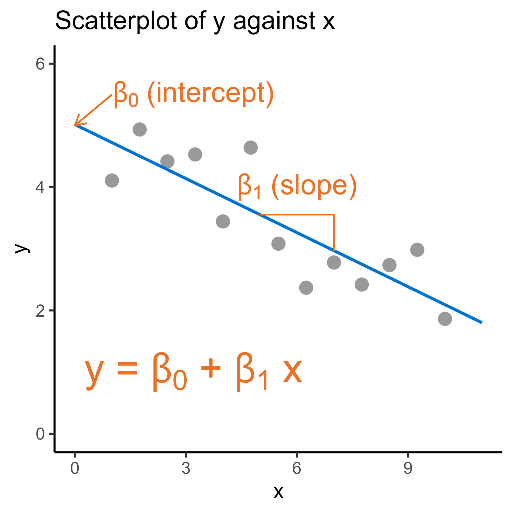
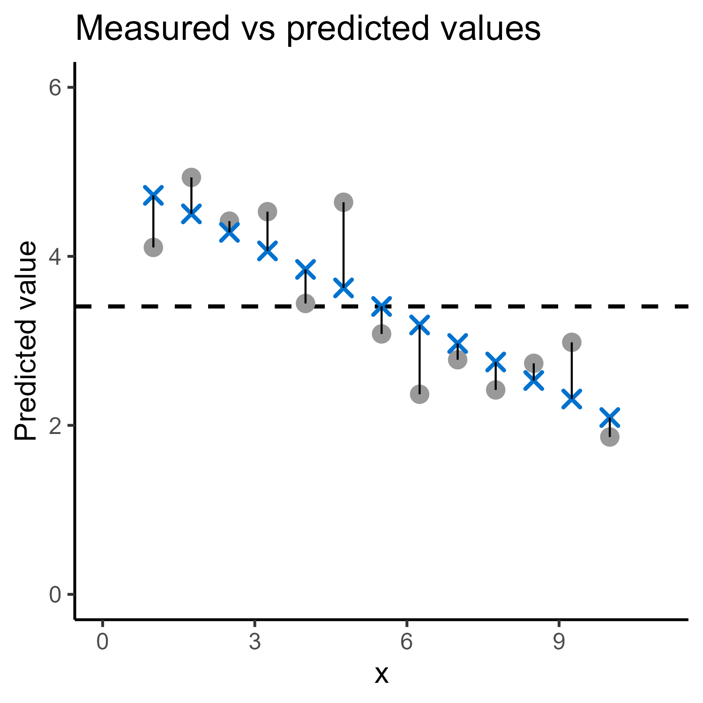

::: callout-note
#### Learning Objectives

- To understand what is meant by the "general linear model"
- To be able to fit models with
  - Continuous predictor variables
  - Any number of categorical or continuous predictor variables
- To understand the assumptions of a linear model
- To understand how to evaluate and interpret the output of a linear model
:::

You will need the following packages for this chapter.

::: panel-tabset
## Install

If you are using these packages for the first time, remember to install them first. Otherwise, you can skip this step.

```{r, install required packages}
#| eval: false
install.packages(c("tidyverse",
                 "rstatix",
                 "ggResidpanel"))
```

## Load  {.active}

```{r, load required packages}
#| message: false
#| warning: false
library(tidyverse)
library(rstatix)
library(ggResidpanel)
```

If you receive an error `there is no package called [package]` then this means you need to install the package first. Click on the `install` tab to see how.
:::

## What is a statistical model?

The formal definition of a statistical model is a mathematical equation that describes the relationship between variables.

The equation will typically have some inbuilt "structure" or assumptions that guide

Depending on our background, you might prefer to think about it as:

- a set of coefficients or weights
- a linear combination of predictors
- a "recipe"
- a rule that describes a set of predictions

### Why do we need a model?

Ultimately, we are attempting to make an inference about the population of interest, based on a subset of that population (i.e., the sample or dataset).

The idea is that if there is a real relationship between variables - a true "**signal**" - in our population, then it will *hopefully* be carried over into our dataset, where we can then detect and quantify it.

However, we recognise that because our dataset is a random sample of our population, and randomness always means a bit of **noise**, the real relationship will be somewhat obscured by random variation.

Fitting a statistical model is our way of attempting to isolate that **signal amongst the noise** in the dataset. It ignores the tiny, messy details to give a clear rule on which to base our inferences and predictions.

### Components of a model

Any given statistical model will have:

- **Data:** The actual numbers or observations that are collected.

- **Variables:** The constructs that are measured, e.g., height, which vary meaningfully or systematically in the experiment or study.

  - **Response variable:** The outcome of interest.

  - **Predictor variable(s):** The variables that are being deliberately varied in the study, in order to assess the affect on the response variable.

- **Parameters:** Numbers (also known as weights or coefficients) associated with the predictor variables, which are tuned (estimated) during model fitting so that the equation fits the data.

- **Fitted/predicted values:** The predicted values of the response variable according to the model equation, when inputting the observed values of the predictor variables for each data point.

- **Residuals:** The errors, or distance, between the value of the response variable for the actual observed data points vs their predicted values according to the model. In other words, residuals are the "noise" in our random dataset.

- **Assumptions:** Features or rules about the behaviour of the data, which must be met for the model to be valid and interpretable.

{fig-align="center" width="60%"}

{fig-align="center" width="60%"}

## What is a **linear** model, specifically?

The linear model is, among all statistical models, perhaps the most structured and specific of all. In other words, it makes more assumptions and applies in a more limited subset of cases than perhaps any other type of model.

This raises the obvious question of why we bother to learn them, but

1.  linear models make for a really clear starting point, because they're so well-defined and relatively simple, and

2.  you've probably already come across linear models before even if you don't realise it.

### The linear model equation

The mathematical form of the equation for any linear model will always be written in this form (varying based on the number of predictors):

$$y = \beta_0 + \beta_1x_1 + ... + \beta_nx_n + \epsilon$$

The components:

- $y$ is the response variable. It must be continuous.

- $x_n$ is a predictor variable. These can take any form - categorical, continuous, transformed residuals, even interactions. Typically, we'd write a equation with an interaction like this: $\beta_0 + \beta_1x_1 + \beta_2x_2 + \beta_3x_1x_2$

- The $\beta$ coefficients represent the "weighting" of their respective predictor variables; note that each coefficient is multiplied by its predictor variable, and then the resulting products are added together. This is typically referred to as a "linear combination" of predictors, or the "linear predictor".

- Finally, $\epsilon$ represents our residuals. Since $y$ represents our actual dataset, we need the error component there to capture the fact that our linear predictor doesn't produce predicted values that match the true data points exactly.

### Re-framing common statistical tests

Most of the "introductory-level" statistical tests that are taught to life sciences students are all just special cases of the linear model.

The only difference between these tests is the nature of the predictor variable(s) (categorical or continuous) and how many of each you have. Each predictor variable will get its own beta coefficient.

+-----------------------------+------------------------------------------------------------------+------------------------------------------------------------------------+
| Common statistical test     | "Classical" explanation                                          | Framed as a linear model                                               |
+=============================+==================================================================+========================================================================+
| T-test (one-sample, paired) | Comparing a set of numbers against a known/theorised mean        | Simplest form of a linear model with no predictors at all              |
+-----------------------------+------------------------------------------------------------------+------------------------------------------------------------------------+
| T-test (two-sample)         | Comparing the difference between two independent means           | Single categorical predictor (with two levels/groups)                  |
+-----------------------------+------------------------------------------------------------------+------------------------------------------------------------------------+
| One-way ANOVA               | Comparing the difference between 3+ independent means            | Single categorical predictor (with 3+ levels/groups)                   |
+-----------------------------+------------------------------------------------------------------+------------------------------------------------------------------------+
| Two-way ANOVA               | Comparing the difference between means across multiple subgroups | Two categorical predictors                                             |
+-----------------------------+------------------------------------------------------------------+------------------------------------------------------------------------+
| Simple linear regression    | Examining the slope of a line of best fit                        | Single continuous predictor                                            |
+-----------------------------+------------------------------------------------------------------+------------------------------------------------------------------------+
| Grouped linear regression   | Examining the slopes of 2+ lines of best fit                     | One categorical + one continuous predictor (plus optional interaction) |
+-----------------------------+------------------------------------------------------------------+------------------------------------------------------------------------+
| More complex models         |                                                                  | Any number of categorical or continuous predictors                     |
+-----------------------------+------------------------------------------------------------------+------------------------------------------------------------------------+

For the vast majority of these tests (with the exception of the t-tests), we calculate an F-statistic for the purposes of then extracting a p-value, if we wish to perform hypothesis testing. The F- or t-statistic in a linear model is effectively a measure of the **strength of the signal to noise ratio**.

## Assumptions

All statistical models make assumptions about the nature of the data and/or the relationship between the variables. Linear models, in particular, make a lot of these assumptions.

Before you begin interpreting and reporting any statistical test - ideally *before* you get to the point of extracting p-values - you should check these assumptions.

### Summary of linear model assumptions

+------------------------------------------+--------------------+-------------------------------------+
| Check                                    | Formal assumption? | Methods for assessing               |
+==========================================+====================+=====================================+
| Continuous response                      | ✔                  | Considering the experimental design |
+------------------------------------------+--------------------+-------------------------------------+
| Independence                             | ✔                  | Considering the experimental design |
+------------------------------------------+--------------------+-------------------------------------+
| Linearity                                | ✔                  | Residual (vs fitted) plot           |
+------------------------------------------+--------------------+-------------------------------------+
| Normality of residuals                   | ✔                  | Normal Q-Q plot                     |
|                                          |                    |                                     |
|                                          |                    | Shapiro-Wilk test                   |
+------------------------------------------+--------------------+-------------------------------------+
| Homogeneity of variance in the residuals | ✔                  | Location-scale plot                 |
|                                          |                    |                                     |
|                                          |                    | Barlett's test, Levene's test       |
+------------------------------------------+--------------------+-------------------------------------+
| Lack of overly influential points        | ✘                  | Cook's distance plot                |
+------------------------------------------+--------------------+-------------------------------------+

We'll come on to the continuous response and independence assumptions when we discuss generalised linear models and mixed effects models.

For assessing the three remaining assumptions, along with determining whether there are any influential points, the most efficient approach is a panel of **diagnostic plots**, described in more detail in the drop-down boxes below.

To get some additional practice interpreting the diagnostic plots, you can use the Shiny app that you downloaded along with the data files for this course. You should be able to launch that app directly with the following code:

```{r, run diagnostic-plots shiny app}
#| eval: false
shiny::runApp("data/diagnostics-shiny.R")
```

::: {.callout-note collapse="true"}
### Linearity

When we fit a linear model, we are assuming a linear relationship between the response variable and the predictor variable (or, in more complex models, between the response variable and the set of predictor variables).

This assumption is typically assessed with a residuals plot (also known as a residuals vs fitted plot).

There should be no clear pattern in the residuals, and if you add the smoother red trend line, it should be *approximately* horizontal around 0:

```{r, residual plot good}
#| echo: false
#| message: false
set.seed(2)
xvar <- runif(30, 5, 20)
yvar <- rnorm(30, mean = (5 - 0.3*xvar), sd = 2.5)
xydat <- data.frame(xvar, yvar)
lm_xydat <- lm(yvar ~ xvar, xydat)
resid_panel(lm_xydat, plots = c("resid"), smoother=TRUE)
```

If you see any actual pattern in this plot - such as the examples shown below - that indicates a lack of linearity.

```{r, residual plot u-shape}
#| echo: false
#| message: false
set.seed(2)
xvar <- runif(30, 5, 20)
yvar <- rnorm(30, mean = (5 - 0.3*xvar^1.9), sd = 2.5)
xydat <- data.frame(xvar, yvar)
lm_xydat <- lm(yvar ~ xvar, xydat)
resid_panel(lm_xydat, plots = c("resid"), smoother=TRUE)
```

```{r, residual plot logs}
#| echo: false
#| message: false
set.seed(271)
xvar <- runif(30, 5, 20)
yvar <- rnorm(30, mean = (2 - 2.5*log(xvar)), sd = 2.5)
xydat <- data.frame(xvar, yvar)
lm_xydat <- lm(yvar ~ xvar, xydat)
resid_panel(lm_xydat, plots = c("resid"), smoother=TRUE)
```

This one is more subtle (but underneath the hood, I can confirm that the assumption is not met). Unfortunately, these plots can often look a little "borderline", especially when the sample size is small.

```{r, residual plot borderline}
#| echo: false
#| message: false
set.seed(712)
xvar <- runif(30, 5, 20)
yvar <- rnorm(30, mean = (5 - 0.3*xvar + 3*(xvar > 12)), sd = 2.5)
xydat <- data.frame(xvar, yvar)
lm_xydat <- lm(yvar ~ xvar, xydat)
resid_panel(lm_xydat, plots = c("resid"), smoother=TRUE)
```

Note that the following is **not** a concern - this particular type of pattern simply indicates that your model only contains categorical predictors.

```{r, residual plot categorical predictor}
#| echo: false
#| message: false
set.seed(271)
xvar <- factor(sample(LETTERS[1:4], 30, replace = TRUE))
yvar <- rnorm(30, mean = c(A = 2, B = 4, C = 6, D = 8)[xvar], sd = 2.5)
xydat <- data.frame(xvar, yvar)
lm_xydat <- lm(yvar ~ xvar, xydat)
resid_panel(lm_xydat, plots = c("resid"), smoother = TRUE)
```
:::

::: {.callout-note collapse="true"}
### Normality of residuals

The
:::

::: {.callout-note collapse="true"}
### Equality of variance

Like normality, this applies to the residuals

Also known as homoscedasticity

Note: the issue is often also observed in the residuals vs fitted plot, so I'm going to show both.
:::

::: {.callout-note collapse="true"}
### Lack of influential points

Not strictly a formal assumption
:::

## Fitting a linear model

In R, the easiest way to fit a linear model is using the `lm` function.

To demo it briefly, we'll test it out on the inbuilt `iris` dataset.

```{r, view iris dataset/variables}
head(iris)
```

We use the

```{r, fit two predictor iris model}
lm_iris <- lm(Sepal.Length ~ Sepal.Width + Species, data = iris)

summary(lm_iris)
```

## Significance testing

A model is just a description of a trend, or the extraction of the signal. It is not, in itself, a test of significance.

We can go a step further with a model, by comparing it against a null hypothesis (i.e., a null model). In other words, we ask, "how likely is it that I would observe data like these, or more extreme, if the population I sampled from has nothing going on between the variables?"

This gives us a probability, also known as a p-value.

## Model comparison

## Summary

::: callout-note
#### Key Points

- Last section of the page is a bulleted summary of the key points
:::
